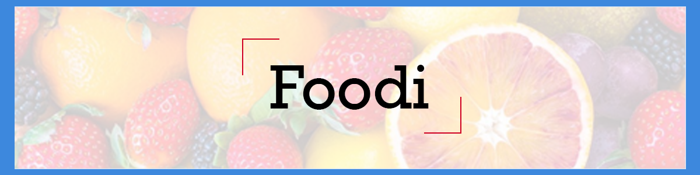
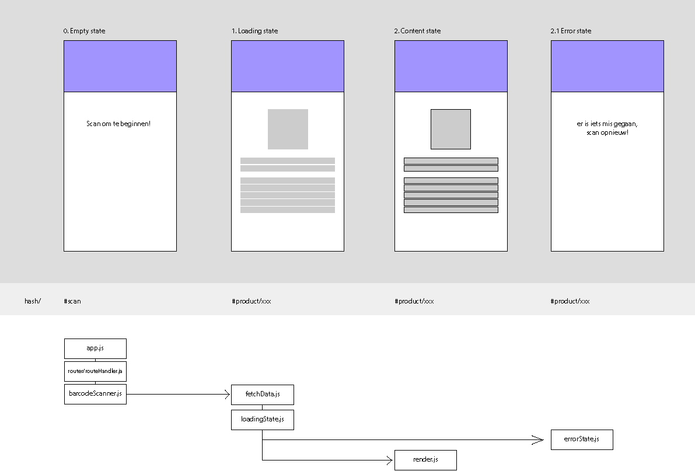

# Foodi



Foodscanners is an app to easily read the nutriens of a product on your phone. Open de WebApp, allow access to the camera and start scanning! Once you start scanning, product and their data will show up on your page!

## User Story

Als foodie, wil ik tijdens het boodschappen doen een product kunnen scannen, zodat ik meer informatie over het product kan lezen en een goede keuze kan maken of het bij mijn dieet past.

## How to use

To use this aplication, simply follow the link [https://martijnvdlans.github.io/food-scanner/FoodApp/index.html](https://martijnvdlans.github.io/food-scanner/FoodApp/index.html)

Allow camera access and aim your camera at the barcode of any product.

## Installment

To install this project on your own device, simply open VScode and paste the following link in your terminal

```
git clone https://github.com/MartijnvdLans/food-scanner.git
```

## Activity Diagram



## Devices

This Barcode API only works on certain devices. These are the ones I know of.

| | Apple  | Android | Windows |
| ------------- | ------------- | ------------- | ------------- |
| Phone  | ❌ | ✅  | -  |
| Desktop  | ✅ | -  | ❌ |

If you have multiple back camera's on your phone and one is a fish eye camera, there is a chance the app will not work because of focussing.

## API's

This application uses openfoodfacts' [API](https://world.openfoodfacts.org/data) and a Barcode detector API.

## Process

To see the process of making this Web App, check out my [wiki](https://github.com/MartijnvdLans/food-scanner/wiki)

## To do

| | Done  |
| ------------- | ------------- |
| Fetch Data from API  | ✅ |
| Render Data from API | ✅ |
| Routing | ✅ |
| Loading state | ✅ |
| Error State | ✅ |
| Personal day goal | |
| Search by name | |
| Save items | |

## Author

Martijn van der Lans

## License

[](https://opensource.org/licenses/MIT)